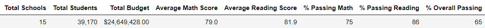
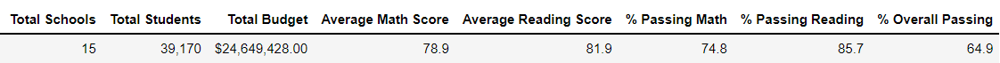

# School_District_Analysis

## Overview
This analysis provides insights to the school board on which strategic decisions at the school and district level will be based on. More specifically, this report analyzes school and district metrics before and after the math and reading scores for Thomas High School (THS) were omitted due to academic dishonesty.

## Resources
* [schools_complete.csv](Resources/schools_complete.csv)
* [students_complete.csv](Resources/students_complete.csv)

## Development Environment
* Python 3.7.10
  * Pandas library
  * Numpy library
* Anaconda 4.10.3
* Jupyter Notebook 6.1.4

## Results

### District Summary
As seen in Figure 1 and Figure 2, taking Thomas High School ninth graders out of the equation had the following effects on the district summary metrics:

* Average Math Score decreased by 0.1%
* Average Reading Score remained unaffected
* % Passing Math decreased by 0.2%
* % Passing Reading decreased by 0.3%
* % Overall Passing decreased by 0.1%

*Figure 1: District summary including THS 9th Grade*

*Figure 2: District summary omitting THS 9th Grade*

### School Summary

How does replacing the ninth graders’ math and reading scores affect Thomas High School’s performance relative to the other schools?
How does replacing the ninth-grade scores affect the following:
Math and reading scores by grade
Scores by school spending
Scores by school size
Scores by school type

## Summary

