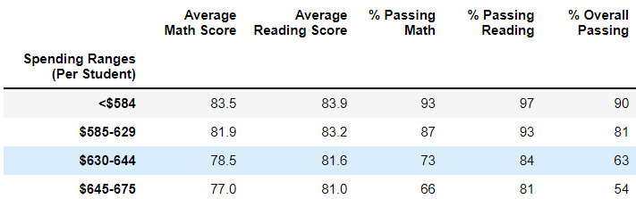
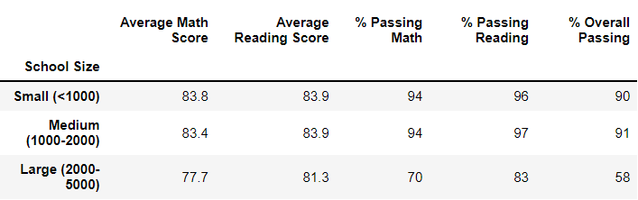

# School_District_Analysis

## Overview

This analysis provides insights to the school board on which strategic decisions at the school and district level will be based on. More specifically, this report analyzes school and district metrics before and after the math and reading scores for Thomas High School (THS) were omitted due to academic dishonesty.

## Resources

* [schools_complete.csv](Resources/schools_complete.csv)
* [students_complete.csv](Resources/students_complete.csv)

## Development Environment

* Python 3.7.10
  * Pandas library
  * Numpy library
* Anaconda 4.10.3
* Jupyter Notebook 6.1.4

## Results

### District Summary

As seen in Figure 1 and Figure 2, taking Thomas High School ninth graders out of the equation had the following effects on the district summary metrics:

* Total Students decreased by 461
* Average Math Score decreased by <1%
* Average Reading Score remained unaffected
* % Passing Math decreased by <1%
* % Passing Reading decreased by <1%
* % Overall Passing decreased by <1%

*Figure 1: District summary before data cleanup*

*Figure 2: District summary after data cleanup*

### School Summary

Cleaning the data had the addected Thomas High School's metrics in the following ways:

* % Passing Math decreased from 93% to 67%
* % Passing Reading decreased from 97% to 70%
* % Overall Passing decreased from 91% to 65%

### School Rankings

Before the the data cleanup, THS was ranked third in the district (see Figure 3). After cleaning the data, their ranking fell to eighth place, as seen in Figure 4.

*Figure 3: School rankings before data cleanup*

*Figure 4: School rankings after data cleanup*

### Math and Reading Scores by Grade

THS 9th grade math and reading scores show "nan" in the clean data.

*Figure 5: Math scores by grade*

*Figure 6: Reading scores by grade*

### Scores by School Spending

The scores in the $630-644 per student spending rage were affected as follows:

* % Passing Math dropped from 73% to 67%
* % Passing Reading dropped from 84% to 77%
* % Overall Passing dropped from 63% to 56%

*Figure 7: Scores by school spending before data cleanup*

*Figure 8: Scores by school spending after data cleanup*

### Scores by School Size

The scores for medium size schools were affected as follows:

* % Passing Math dropped from 94% to 85%
* % Passing Reading dropped from 97% to 91%
* % Overall Passing dropped from 91% to 85%

*Figure 9: Scores by school size before data cleanup*

*Figure 10: Scores by school size after data cleanup*

### Scores by School Type

Charter school scores were affected as follows:

* % Passing Math dropped from 94% to 90%
* % Passing Reading droppedd from 97% to 93%
* % Overall Passing dropped from 90% to 87%

*Figure 11: Scores by school type before data cleanup*

*Figure 12: Scores by school type after data cleanup*

## Summary

